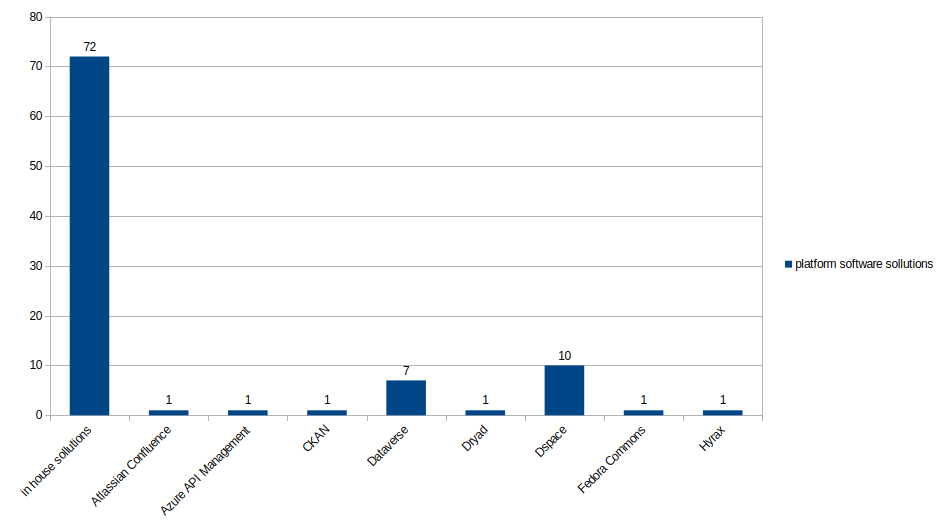

# apis-data-source

These are API data gathered to realize quick access and to keep a tab on what is out there. The data will be updated as often as possible. A subset of digital repositories awarded with CoreTrustSeal were analysed in search for their APIs.

Some brief conclusions:

The goal is to keep track of the existing data outlets. It might prove useful in certain projects when readily available dats are needed.

CoreTrustSeal Set

Last update January 2024.

This dataset is part of a larger study.

(Teza UnitBv)
