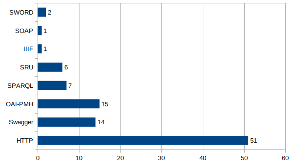

# apis-data-source

These are API data gathered to realize quick access and to keep a tab on what is out there. The data will be updated as often as possible.

Some brief conclusions:

The goal is to keep track of the existing data outlets. It might prove useful in certain projects when readily available date is needed.

Last update August 2023.

This dataset is part of a larger study.

(Teza UnitBv)
